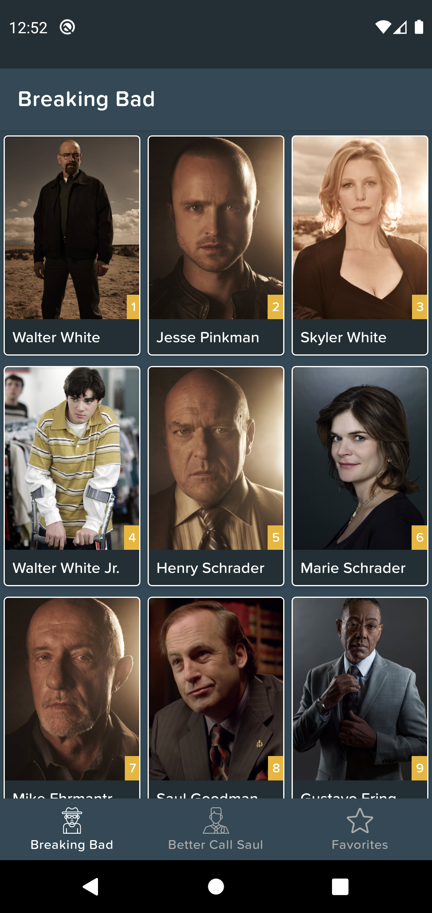
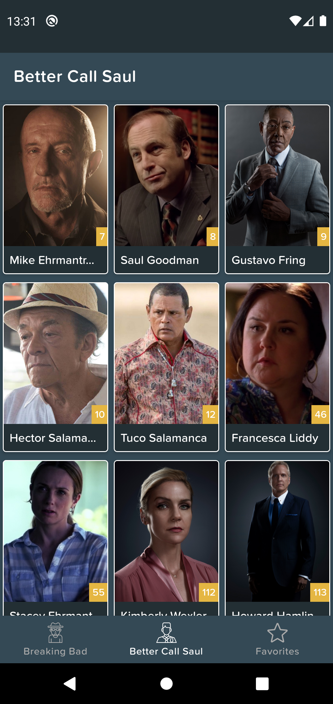
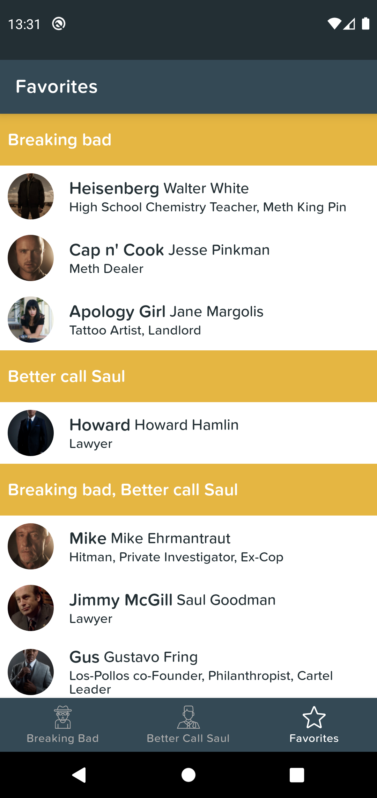
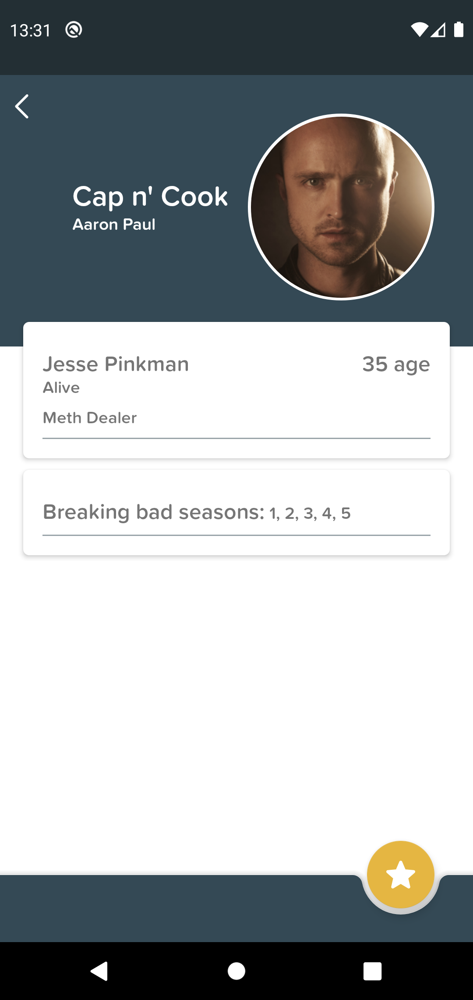

# Breaking Bad and Better call Saul

Repository to show architecture, testing and some android technologies.

Breaking Bad       | Better Call Saul    | Favorites         | Detail
------------------ | ------------------- | ----------------- | ----------
 |  |  | 

### Architecture
- Clean architecture
- MVI

### Testing
- TDD
- Mockito
- Coroutine test

### Technologies
- Retrofit & OkHttp
- Coroutines
- Koin
- ViewModel & Livedata
- Room database
- View Binding
- Glide
- Lottie animations

[The Breaking Bad API](https://breakingbadapi.com/)
